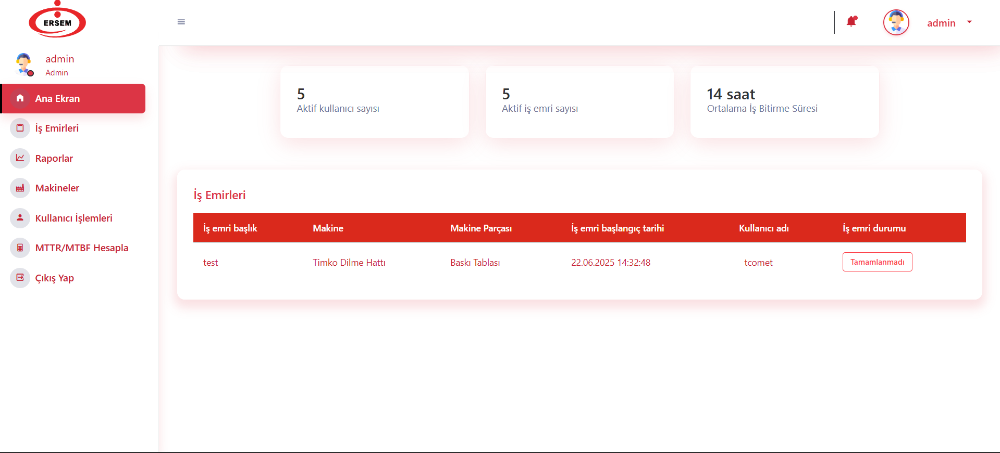
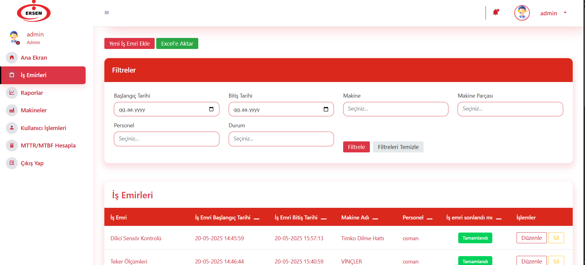
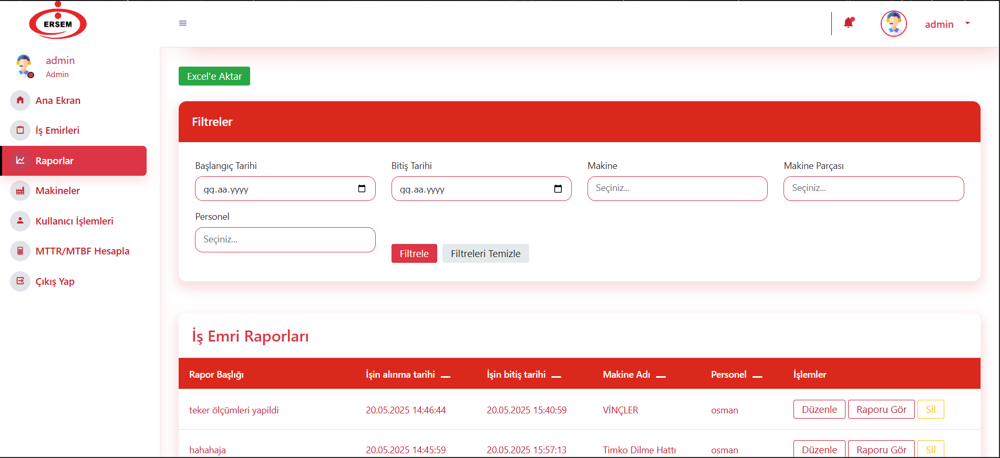
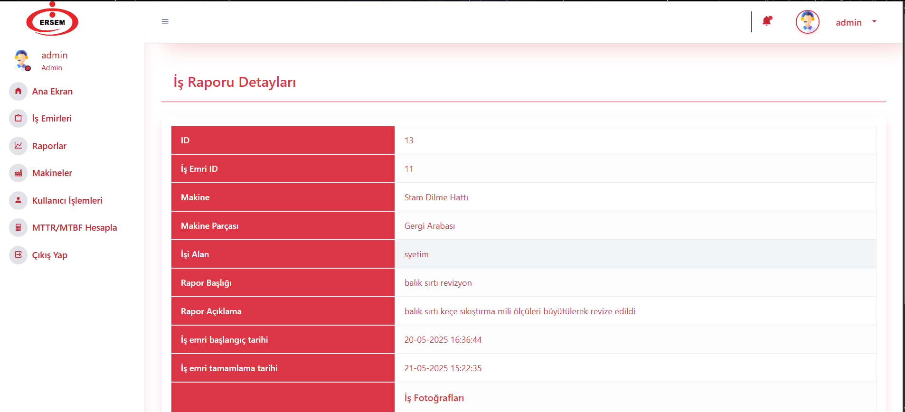
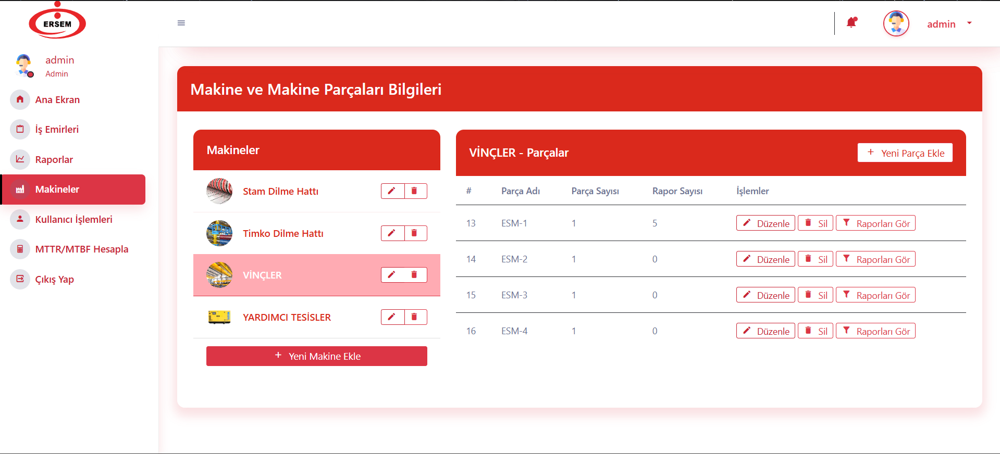
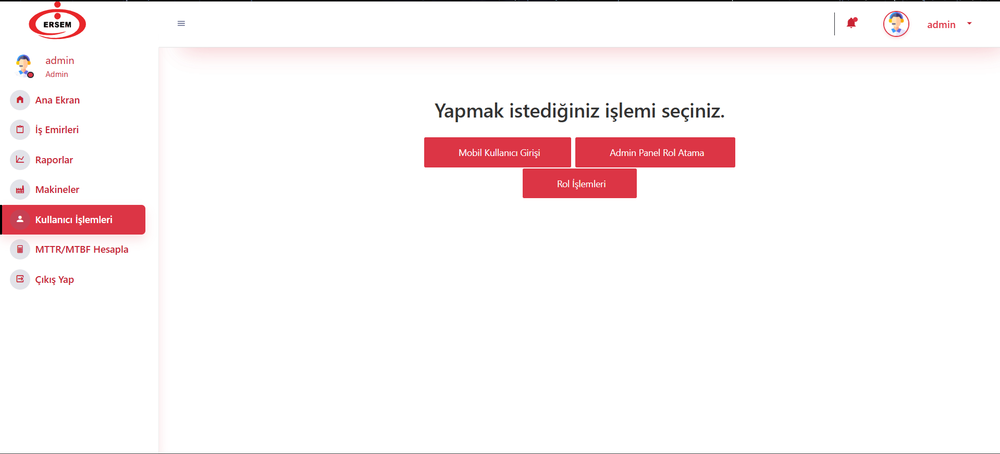

# Arıza Kayıt ve Bakım Yönetim Sistemi - Web API & Yönetim Paneli

Bu depo, fabrika ortamındaki makinelerin bakım ve arıza takip süreçlerini dijitalleştirmeyi amaçlayan projenin **ASP.NET Core Web API** ve **ASP.NET Core MVC Yönetim Paneli** bileşenlerini içermektedir.

## Projeye Genel Bakış

Proje üç ana bileşenden oluşur:
1.  **Merkezi Web API (.NET 6):** Tüm veri işlemlerini, iş mantığını ve doğrulamayı yöneten merkezi beyin. Hem yönetim paneli hem de mobil uygulama için veri kaynağı görevi görür.
2.  **Yönetim Paneli (ASP.NET Core MVC):** Yöneticilerin ve yetkili personelin sistemi yönettiği, raporları görüntülediği, kullanıcı ve makine-parça envanterini yönettiği web tabanlı arayüz.
3.  **Android Mobil Uygulaması (Ayrı Repo):** Saha teknisyenlerinin kendilerine atanan iş emirlerini gördüğü, yaptıkları işlerle ilgili raporlar (açıklama ve resimler dahil) girdiği mobil uygulama.


## Kullanılan Teknolojiler

- **Backend:** .NET 6
- **Mimari:** N-Tier Architecture (Katmanlı Mimari)
- **API:** ASP.NET Core Web API
- **Admin Panel:** ASP.NET Core MVC
- **Veri Erişimi:** Entity Framework Core (Code-First Yaklaşımı)
- **Veritabanı:** Microsoft SQL Server
- **Kimlik Doğrulama & Yetkilendirme:** ASP.NET Core Identity
- **Yetkilendirme Modeli:** Rol ve Claim Bazlı Politika (Role & Claim-Based Policies)
- **Gerçek Zamanlı Bildirim:** SignalR (Bildirimler için altyapı mevcut)
- **Excel İşlemleri:** ClosedXML

## Proje Mimarisi

Proje, sorumlulukların ayrılması prensibine dayalı olarak katmanlı bir mimari ile geliştirilmiştir:

-   **`EntityLayer`:** Veritabanı tablolarını temsil eden POCO (Plain Old C# Object) sınıflarını içerir.
-   **`DataAccessLayer`:** Entity Framework Core ve **Repository Pattern** kullanarak veritabanı işlemlerini (CRUD) yönetir. `context.cs` sınıfı, veritabanı bağlantısını ve tablo ilişkilerini tanımlar.
-   **`BusinessLayer`:** `...Manager` sınıfları ile iş kurallarını ve mantığını barındırır. DataAccess katmanı üzerinde bir soyutlama sağlar.
-   **`ArizaKayitApi` (Sunum Katmanı - API):** Dış dünyaya servis sağlayan API kontrolcülerini içerir.
-   **`ArizaKaydi` (Sunum Katmanı - MVC):** Yönetim paneline ait kontrolcüler, view'lar ve view model'ları içerir.

---

## Yönetim Paneli Özellikleri (`ArizaKaydi` Projesi)

Yönetim paneli, sistemin tüm yönleriyle yönetilmesini sağlayan zengin özelliklere sahiptir:

#### 1. Dashboard
-   Anlık istatistikler (Açık iş emri sayısı, mobil kullanıcı sayısı vb.).
-   İşlerin ortalama tamamlanma süresi (MTTR benzeri bir metrik) gibi önemli performans göstergeleri.
-   Son eklenen iş emirlerinin listesi.

#### 2. İş Emri Yönetimi (`WorkController`)
-   Tüm iş emirlerini listeleme, yeni iş emri oluşturma, düzenleme ve silme.
-   **Gelişmiş Filtreleme:** Tarih aralığı, makine, makine parçası, atanan kullanıcı ve tamamlanma durumuna göre filtreleme.
-   **Sıralama:** ID, tarih, makine vb. alanlara göre artan/azalan sıralama.
-   **Excel'e Aktarma:** Filtrelenmiş veya tüm iş emri listesini `.xlsx` formatında dışa aktarma.

#### 3. İş Raporları Yönetimi (`ReportController`)
-   Mobil uygulama üzerinden girilen tüm iş raporlarını görüntüleme.
-   İş emirlerine benzer şekilde gelişmiş filtreleme ve sıralama yetenekleri.
-   Rapor detaylarında yapılan işin açıklaması ve teknisyen tarafından yüklenen resimleri görüntüleme.
-   Listelenen raporları **Excel'e aktarma**.


#### 4. Envanter Yönetimi (`DefaultController`)
-   Sisteme yeni makineler ve bu makinelere ait parçaları ekleme, düzenleme ve silme (CRUD).
-   Makineleri ve onlara bağlı parçaları hiyerarşik olarak görüntüleme.

#### 5. Kullanıcı ve Yetki Yönetimi (`UserController`)
-   **İki Farklı Kullanıcı Tipi Yönetimi:**
    -   **Mobil Kullanıcılar:** Android uygulamasını kullanacak teknisyenlerin yönetimi.
    -   **Panel Kullanıcıları:** Yönetim paneline erişimi olan kullanıcılar.
-   **Rol ve İzin Yönetimi:**
    -   Yeni roller (örn: Admin, Bakım Şefi) oluşturma, düzenleme ve silme.
    -   **Claim Bazlı Yetkilendirme:** Her role, sistemdeki farklı modüller için özel izinler (görüntüleme, düzenleme vb.) atama. Bu sayede son derece esnek bir yetkilendirme altyapısı sunulur.

## Web API Mimarisi ve Servisleri (`ArizaKayitApi` Projesi)

API, projenin veri ve iş mantığı merkezidir. Servisler, kullanım amaçlarına göre iki ana gruba ayrılır:

#### Mobil Uygulama Tarafından Kullanılan Servisler
Bu endpoint'ler, saha teknisyenlerinin kullandığı Android uygulamasının temel işlevlerini destekler:

-   **`WorkOrderController`:** Kendisine atanmış, açık durumdaki iş emirlerini listeler.
-   **`WorkController`:** Bir iş emrine bağlı olarak yeni iş raporu oluşturur ve mevcut raporu günceller.
-   **`ImageDataController`:** Oluşturulan iş raporlarına bir veya daha fazla resim yükler.
-   **`BildirimlerController`:** İş emirlerini ve genel bildirimleri mobil uygulamaya gönderir.
-   **`UserController (getUsers)`:** Mobil kullanıcının sisteme giriş yapmasını sağlar.

#### Yönetim Paneli ve Genel Amaçlı Servisler
Bu endpoint'ler, genellikle yönetim paneli tarafından tüm veriye erişmek ve sistemi yönetmek için kullanılır.

-   **`MachineController`, `MachinePartController`:** Makineler ve parçalar için tam CRUD işlemleri.
-   **`WorkOrderController`, `WorkController`:** İş emirleri ve raporları için tam CRUD işlemleri ve detaylı listeleme.
-   **`UserController`:** Mobil kullanıcıları yönetmek için CRUD işlemleri.
-   **`ImageDataController`:** Arıza ve işlere ait resimleri listeleme.

---

## Kurulum ve Başlatma

Projeyi yerel makinenizde çalıştırmak için aşağıdaki adımları izleyin:

#### 1. Veritabanı Kurulumu
1.  **Connection String:** `DataAccessLayer` projesi içerisindeki `context.cs` dosyasında bulunan `OnConfiguring` metodundaki veritabanı bağlantı dizesini kendi SQL Server bilgilerinize göre güncelleyin.
    ```csharp
    // DataAccessLayer/Concrete/context.cs
    optionsBuilder.UseSqlServer("server=YOUR_SERVER_NAME;database=ArizaKayit;...;", options =>
    {
        options.CommandTimeout(3000);
    });
    ```
2.  **Veritabanını Oluşturma:**
    -   Visual Studio'da **Package Manager Console**'u açın.
    -   Default project olarak `DataAccessLayer` projesini seçin.
    -   `Update-Database` komutunu çalıştırarak veritabanını ve tabloları oluşturun.

#### 2. Projeyi Çalıştırma
1.  Çözümü Visual Studio'da açın.
2.  Solution üzerine sağ tıklayıp **"Configure Startup Projects..."** seçeneğini seçin.
3.  **Multiple startup projects**'i seçerek `ArizaKayitApi` ve `ArizaKaydi` projelerinin başlangıç eylemini **"Start"** olarak ayarlayın.
4.  Projeyi `F5` tuşu ile başlatın. API ve MVC paneli birlikte çalışmaya başlayacaktır.

## Yetkilendirme Modeli (Panel için)

Yönetim paneli, **ASP.NET Core Identity** ve **Policy-Based Authorization** kullanır. Yetkiler, `Program.cs` (veya `Startup.cs`) dosyasında tanımlanan politikalara dayanır. Her politika, kullanıcının rolüne atanmış belirli bir "Claim" (talep) gerektirir.

Örnek Politika Tanımı:
```csharp
// Program.cs
builder.Services.AddAuthorization(options =>
{
    // Sadece "Permission" claim'i "BasicModerator.View" değerine sahip olanlar erişebilir.
    options.AddPolicy("BasicModeratorViewPermission", policy =>
        policy.RequireClaim("Permission", "BasicModerator.View"));
});
